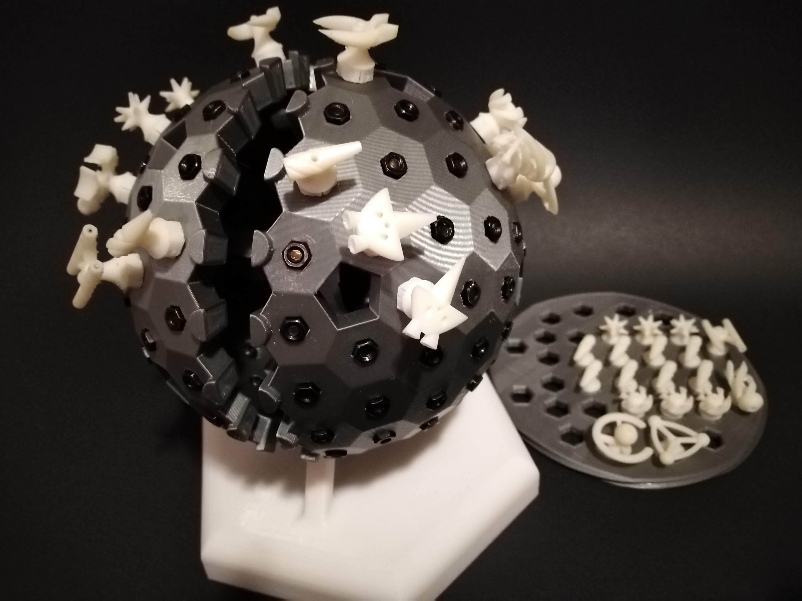

Space Chess
===========

Chess on a 3D hexagonal grid, with spaceships!

Rules
-----

The Aliens and Terrans are engaged in battle with their ships and mines. Both factions have
the same ship classes with different styling. The aim is to destroy the enemy command ship.

Players take turns making their moves, each turn a player has 2 actions he can perform, except
for the first turn when the first player should perform just 1 action. Every ship can move 1
hex as one of their actions, but otherwise they have different abilities listed below. After
every turn there is a battle stage where projectiles advance and ships are destroyed.

*Command Flagship*:

Command ships are the key unit that must be protected. They are however weak and move slowly.
* Move 1 hex.

*Gunship*:

Gunships are the long distance siege units. They can fire an *Impactor* that will destroy any
ship it encounters. Beware that it can do a full orbit and destroy your own gunship! The
projectile will dissipate if it encounters the pentagonal holes on the grid.
* Fire projectile in direction the ship is facing. The *Impactor* will move in a straight line
by 1 hex at the end of each player's turn (thus 2 hexes per round). Projectiles will appear
directly in front of the *Gunship* (although it's recommended you place it directly 2 hexes in
front as it will immediately advance at the end of the turn). If firing twice in a row, place
the projectiles 1 and 2 hexes in front of the ship and skip advancing them.
* Rotate the ship to aim.
* Move 1 hex; the gunship should then be pointed in the direction it moved.

*Fighter*:

Fighters are the agile attacking units.
* Move up to 2 hexes in a straight line. If using both actions to move the same ship, then the second
move is limited to 1 hex distance.

*Support Ship*:

Support ships deploy up to 5 *Mines* to provide tactical cover. Once placed the mines can not
be moved, but will act as an allied ship during the battle stage.
* Move 1 hex.
* Deploy 1 *Mine* in an adjacent hex, but not in a hex adjacent to an enemy ship or mine.

### Battle Stage

After each player takes their actions there is a battle stage that occurs in 4 steps.
1. Projectiles: Advance both player's *Impactors* by 1 hex.
2. Direct Strike: If any ship or impactor was moved on the hex of an enemy ship then both ships get destroyer.
A draw can be obtained by mutual command ship destruction.
3. Outnumbered: Any ship or mine that's adjacent to 2 enemy ships or mines (but no projectiles) gets destroyer.
Mines will be spent in an attack, however the attacking ships will be spared if not themselves outnumbered.
4. Isolated Skirmish: Any lone ships or mines adjacent to an isolated enemy ship or mine will be destroyed and
take down the enemy with them.