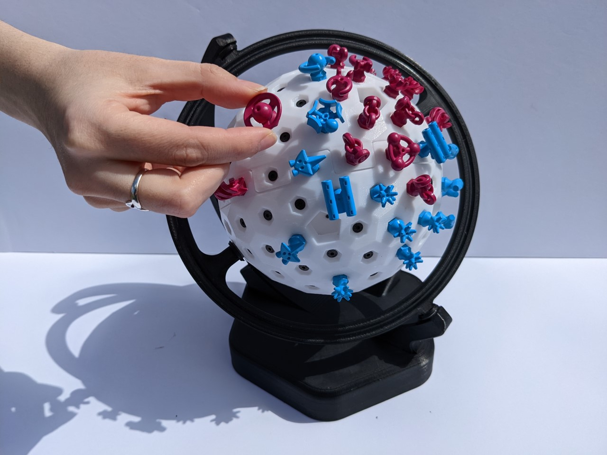
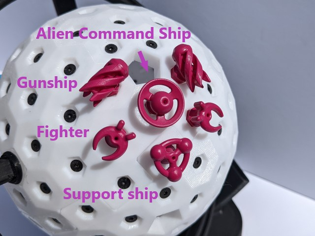
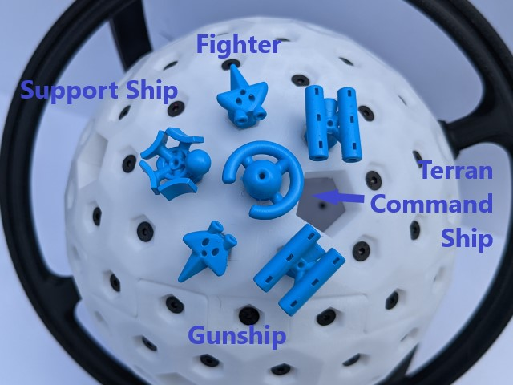
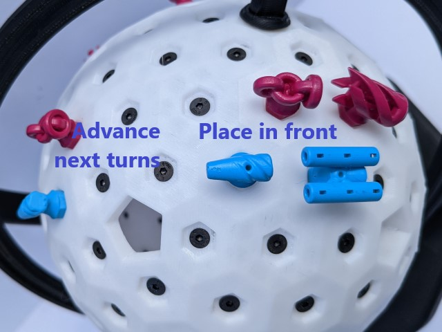
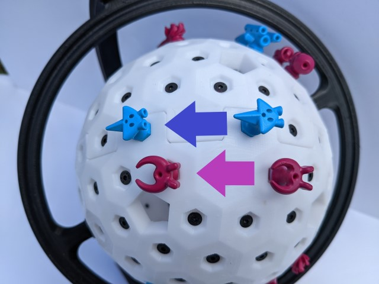
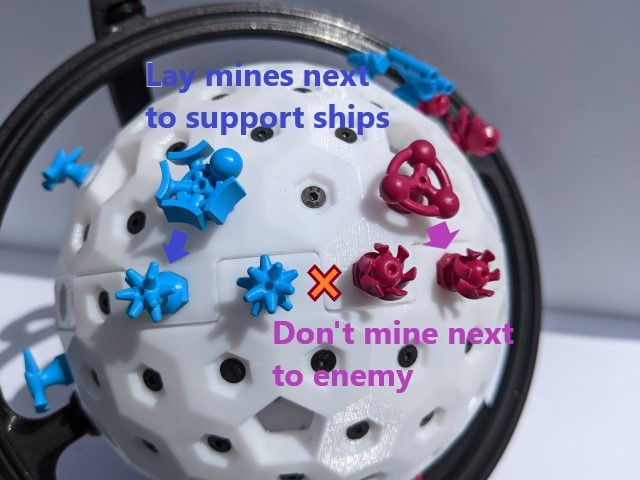
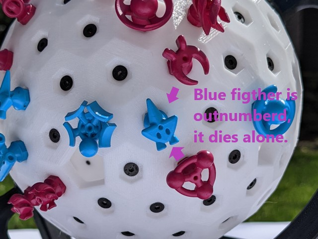
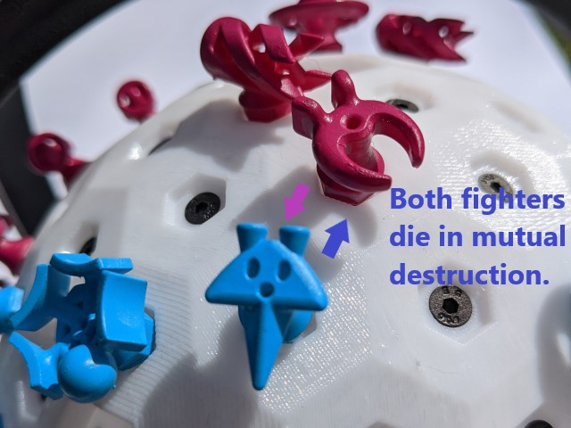
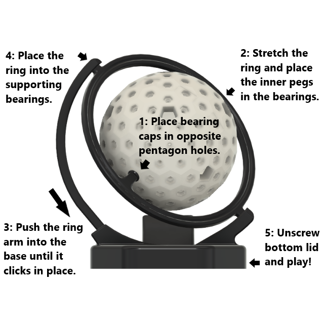

Space Chess
===========

Chess on a 3D hexagonal grid, with spaceships!

Rules
-----

The Aliens and Terrans are engaged in battle with their ships. Both factions have the same ship
classes with different styling. The aim is to destroy the enemy command ship, the circular ships
with a ball in the middle.

Players take turns making their moves. There are 2 actions allowed per turn except the first turn
where the first player starts with only 1 action. Every ship can move up to 2 hexes in a line as one
of their actions, but they have different abilities depending on their type. The moves must not jump
over occupied pieces, nor over the pentagons and the ships must land in a free hex. (Did you know a 
hex tiled sphere must always include 12 pentagons?) After every turn there is a battle stage where 
projectiles advance and ships are destroyed.

    
    

**Command Flagship**:

Command ships are the key unit that must be protected, the objective is to destroy the enemy command!
* Move up to 2 hexes to a free space, all hexes must be free.
* Use both actions to re-build any destroyed ship.

**Gunship**:

Gunships are long distance siege units. They can fire an *Impactor* that will destroy any
ship it encounters. Beware that it can do a full orbit and destroy your own gunship! The
projectile will dissipate if it encounters the pentagonal holes on the grid.
* Move up to 2 hexes to a free space.
* Fire a projectile in any direction. Start by placing the *Impactor* directly in front of the ship.
At the beggining of each turn advance in-flight projectiles by 4 hexes in a straight line, as fired.
Projectiles destroy the first unit in their path, friend or foe. Remove the *Impactor* and place it 
back for reuse after it hits a target or passes over the forbidden pentagons.

**Fighter**:

Fighters are the agile attacking units.
* Move up to 3 hexes in a straight line per action. Must traverse a free path.

**Support Ship**:

Support ships deploy up to 5 *Mines* to provide tactical cover. Once placed the mines can not
be moved, but will act as an allied ship during the battle stage.
* Move up to 2 hexes to a free space.
* Deploy a *Mine* in an adjacent hex, but not in a hex adjacent to an enemy ship or mine.

### Battle Stage

After a player takes both actions there is a battle stage where ships next to an enemy will fight.
Calculate the power of each fighting ship by the number of friendly ships or mines next to it.
For every pair of battling ships, destroy the ones that have less or equal power. Equal battles 
means that both sides lose. Also destroy all mines that participated in battle (adjacent to a 
friendly ship that needed their power).

    
    

### Game Board Assembly

The arm piece snap fits into the base; it requires a bit of force, but not too much. You'll have to stretch the ring 
to push it in place around the ball; then stretch the long arm to put the ring on the base. The ships are in the base!

    
    

**Thanks for playing!** Space Chess is open-source, you can find the rules and 3D models at: github.com/csiz/Space-Chess
