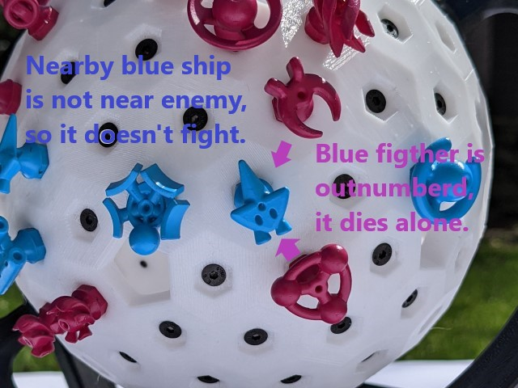

Space Chess
===========

Chess on a 3D hexagonal grid, with spaceships!

Rules
-----

The Aliens and Terrans are engaged in battle with their ships. Both factions have the same ship
classes with different styling. The aim is to destroy the enemy command ship, the circular ships
with a ball in the middle.

Players take turns making their moves. There are 2 actions allowed per turn except the first turn
where the first player starts with only 1 action. Every ship can move up to 2 hexes in a line as one
of their actions, but they have different abilities depending on their type. The moves must not jump
over occupied pieces, nor over the pentagons and the ships must land in a free hex. (Did you know a 
hex tiled sphere must always include 12 pentagons?) After every turn there is a battle stage where 
projectiles advance and ships are destroyed.

    
    

**Command Flagship**:

Command ships are the key unit that must be protected, but they move slowly.
* Move up to 2 hexes to a free space.

**Gunship**:

Gunships are long distance siege units. They can fire an *Impactor* that will destroy any
ship it encounters. Beware that it can do a full orbit and destroy your own gunship! The
projectile will dissipate if it encounters the pentagonal holes on the grid.
* Move up to 2 hexes to a free space.
* Fire a projectile in any direction. Start by placing the *Impactor* directly in front of the ship,
then at the end of subsequent turns advance your in-flight projectiles by 4 hexes in a straight line.

**Fighter**:

Fighters are the agile attacking units.
* Move up to 4 hexes in a straight line per action. Must land in a free space.

**Support Ship**:

Support ships deploy up to 5 *Mines* to provide tactical cover. Once placed the mines can not
be moved, but will act as an allied ship during the battle stage.
* Move up to 2 hexes to a free space.
* Deploy a *Mine* in an adjacent hex, but not in a hex adjacent to an enemy ship or mine.

### Battle Stage

After each player takes their actions there is a battle stage that occurs in 3 steps.
1. Direct Strike: Move the player's projectiles ahead by 4 hexes or destroy the first unit that was in the path
of the projectile. The *Impactor* will hit any unit including your own, you can use it to clear mines or intercept
other projectiles. Remove the *Impactor* and place it back for reuse after it hits a target or forbidden pentagons.
2. Outnumbered: Destroy every ship or mine that's adjacent to 2 or more enemy ships or mines (but not projectiles).
Mines will be spent in an attack. The attacking ships will be spared if not themselves outnumbered.
3. Mutual Destruction: Any ship adjacent to 1 enemy ship or mine will be destroyed and take down the enemy with them.

    
    

**Thanks for playing!** Space Chess is open-source, you can find the rules and 3D models at: github.com/csiz/Space-Chess